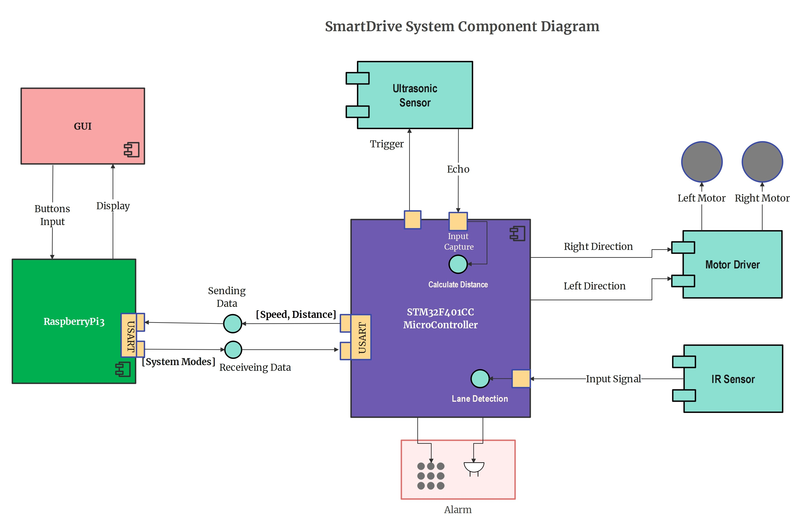
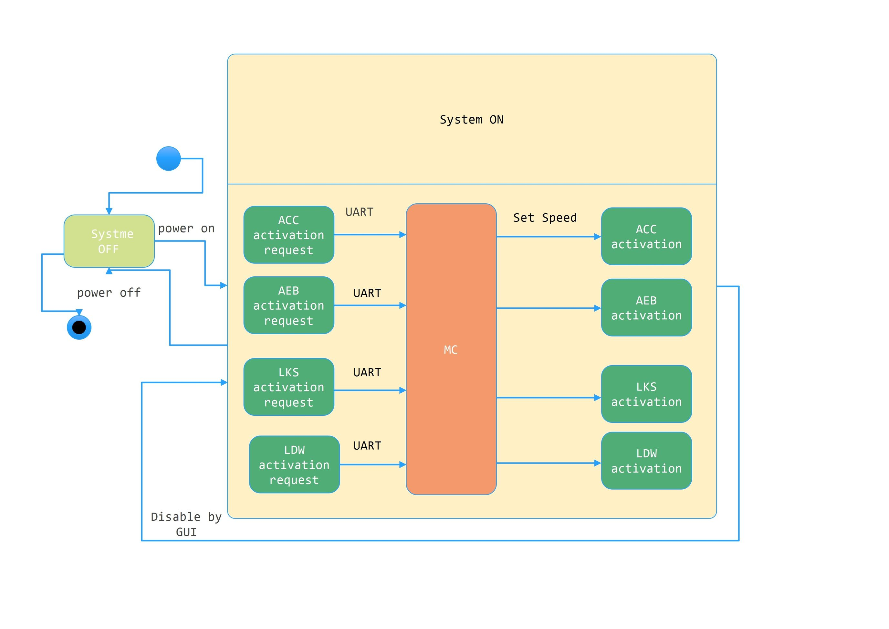
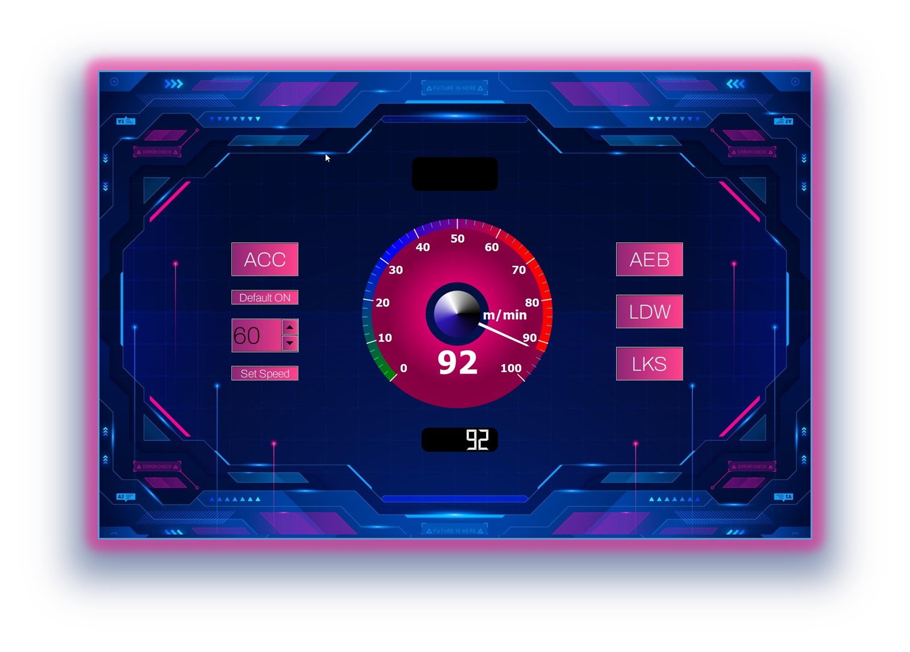

# SmartDrive

SmartDrive is a project that aims to develop a smart driving system. It includes firmware for various features and peripherals, along with documentation, examples, and tests.

## System Diagram

The system diagram below illustrates the components and their interactions in the SmartDrive system.

## State Machine

The state machine represents the behavior of the SmartDrive system. It describes the different states and transitions of the system during operation.

The SmartDrive system operates based on a state machine with the following states:

1. Idle
2. ACC (Adaptive Cruise Control)
3. LDW (Lane Departure Warning)
4. AEB (Automated Emergency Braking)
5. LKS (Lane Keeping Support)

The state transitions are as follows:

- From Idle:
    - Transition to ACC state when the ACC mode is enabled.
    - Transition to LDW state when the LDW mode is enabled.
- From ACC:
    - Transition to Idle state when the ACC mode is disabled.
    - Transition to AEB state when a potential collision risk is detected.
- From LDW:
    - Transition to Idle state when the LDW mode is disabled.
    - Transition to LKS state when the vehicle deviates from the lane.
- From AEB:
    - Transition to Idle state when the collision risk is mitigated.
- From LKS:
    - Transition to Idle state when the vehicle is back within the lane.

## GUI

The SmartDrive project includes a graphical user interface (GUI) that provides an intuitive and user-friendly interface for interacting with the system. The GUI allows users to monitor the system's status, configure settings, and visualize data in real-time. Some key features of the GUI include:

- Real-time visualization of sensor data such as vehicle speed, distance to objects, and lane position.
- Interactive controls for enabling/disabling various ADAS modes, such as Adaptive Cruise Control (ACC), Lane Departure Warning (LDW), and Automated Emergency Braking (AEB).
- Configurable settings for adjusting sensitivity thresholds, warning/alert preferences, and system behavior.
- Graphical representation of the vehicle's trajectory, highlighting detected lane markings and potential collision risks.
- Logging and exporting of system data for further analysis and evaluation.

The GUI is developed using the Qt framework and Python, providing a cross-platform solution that can run on various operating systems. It utilizes the PyQt library for seamless integration of Qt with Python. The GUI module is located in the `firmware/App` directory.

For more information on using and customizing the GUI, please refer to the [Qt for Python Documentation](https://doc.qt.io/qtforpython-6/).

## Demo

To see SmartDrive in action, you can run the provided example code. Follow the steps below to set up and run the demo:

1. Clone the repository: `git clone https://github.com/k-abdulaziz/SmartDrive.git`
2. Install the necessary dependencies: `cd SmartDrive && npm install`
3. Build the firmware: `make firmware`
4. Connect the SmartDrive hardware to your computer.
5. Run the demo application: `npm run demo`

The demo will showcase the various features of the SmartDrive system, including adaptive cruise control, lane departure warning, and automatic emergency braking.

## Documentation

For detailed information on how to use SmartDrive and its firmware, refer to the documentation provided in the `docs` directory. The documentation includes user guides, API references, and system specifications.

## Examples

The `examples` directory contains example code snippets and projects that demonstrate specific functionalities of the SmartDrive system. You can explore these examples to learn how to integrate SmartDrive into your own projects.

## Tests

The `tests` directory contains test cases and test scripts to ensure the functionality and reliability of the SmartDrive system. Running the tests will validate the different components and features of the system.

## Contributing

Contributions to SmartDrive are welcome! If you have any bug fixes, improvements, or new features to contribute, please submit a pull request. Make sure to follow the code style guidelines and write appropriate tests for your changes.

## License

SmartDrive is released under the [MIT License](LICENSE).

Please refer to the individual files and directories for specific licenses associated with the included firmware, libraries, and dependencies.

## References

- Thalen, J. P. (2006). ADAS for the Car of the Future. Retrieved from [https://essay.utwente.nl/58373/](https://essay.utwente.nl/58373/)
- Zhu, J., Chen, Y., & Li, Z. (2012). A survey on cooperative adaptive cruise control systems. IEEE Transactions on Intelligent Transportation Systems, 13(3), 1239-1254. doi:10.1109/TITS.2012.2193264
- Zhao, H., & Zhang, H. (2021). Cooperative adaptive cruise control with lane change assistance based on extended Kalman filter. IEEE Transactions on Intelligent Transportation Systems, 22(10), 4469-4481. doi:10.1109/TITS.2021.3075173
- Automated Emergency Braking Systems: Technical requirements, costs and benefits. V1.1 by C Grover, I Knight, F Okoro, I Simmons, G Couper, P Massie, B Smith (TRL Limited)
- Winner, H., Schopper, M. (2016). Adaptive Cruise Control. In: Winner, H., Hakuli, S., Lotz, F., Singer, C. (eds) Handbook of Driver Assistance Systems. Springer, Cham. [https://doi.org/10.1007/978-3-319-12352-3_46](https://doi.org/10.1007/978-3-319-12352-3_46)
- Eom H, Lee SH. Human-Automation Interaction Design for Adaptive Cruise Control Systems of Ground Vehicles. Sensors. 2015; 15(6):13916-13944. [https://doi.org/10.3390/s150613916](https://doi.org/10.3390/s150613916)
- [Qt for Python Documentation](https://doc.qt.io/qtforpython-6/)
- [Doxygen Documentation](https://www.doxygen.nl/manual/)
